# Lab 1C — Member 1 Screenshot Checklist

## Windows Server 2022 Verification

Use this file to organize and label all screenshots for **Member 1** of Lab 1C.

The lab requires Member 1 to verify the Windows Server 2022 guest from Lab 1B before the other members proceed.

---

## Screenshot 01 — Windows Server Hostname

**Purpose:** Verify that the Windows Server hostname is correct.

**Command used:**

```cmd
hostname
```

**Expected result:**

```text
WINSRV-DORSU-[GroupID]
```

**Screenshot:**

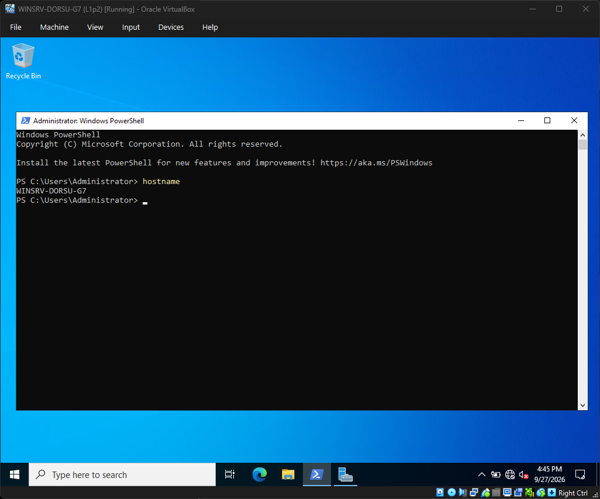

---

## Screenshot 02 — Windows Server IP Configuration

**Purpose:** Verify the static IP configuration of the Windows Server.

**Command used:**

```cmd
ipconfig /all
```

**Required values:**

| Setting         | Expected Value    |
| --------------- | ----------------- |
| IPv4 Address    | `192.168.10.11` |
| Subnet Mask     | `255.255.255.0` |
| Default Gateway | `192.168.10.1`  |
| Adapter         | Bridged           |

**Screenshot:**

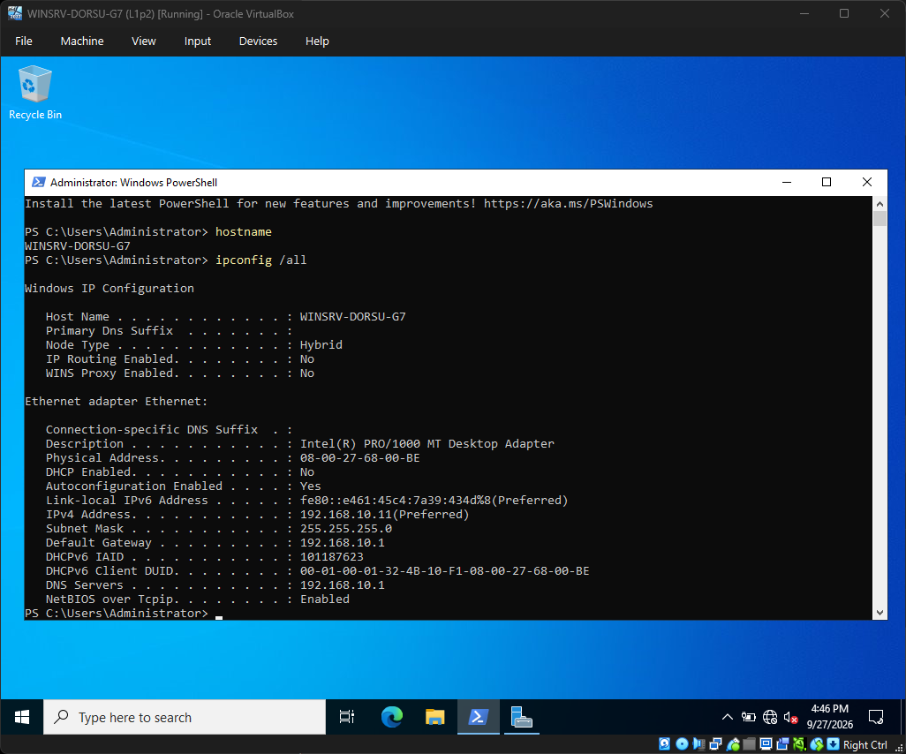

---

## Screenshot 03 — Remote Desktop

**Purpose:** Verify that Remote Desktop is enabled.

**Location:**

```text
Server Manager → Local Server → Remote Desktop
```

**Expected result:**

```text
Enabled
```

**Screenshot:**

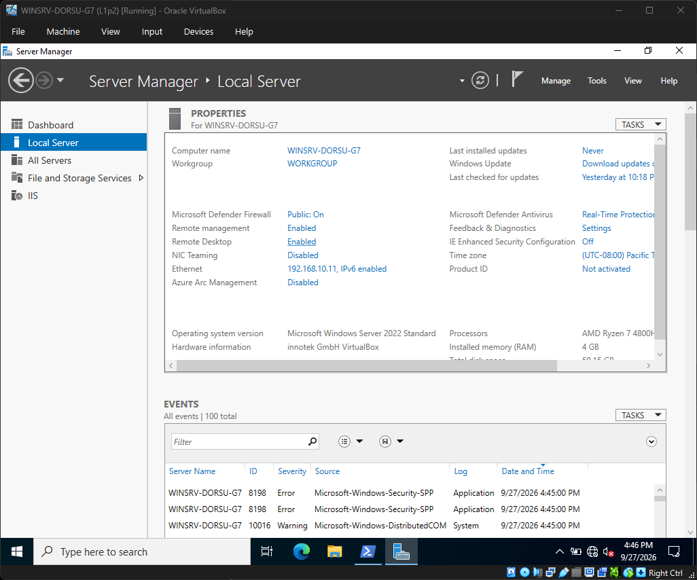

---

## Screenshot 04 — RSAT

**Purpose:** Verify that RSAT is installed/present.

**Server Manager verification:**

```text
Server Manager → Tools
```

**Alternative verification:**

```powershell
Get-WindowsFeature *RSAT*
```

If RSAT is installed, the relevant feature should show:

```text
Install State : Installed
```

**Screenshot:**

 

**Note:** If RSAT is installed but does not appear under the Server Manager Tools menu, keep the PowerShell verification screenshot as evidence and check the specific RSAT feature installed.

---

## Screenshot 05 — Windows Server VM Firewall ICMPv4 Rule

**Purpose:** Verify that Windows allows inbound ICMPv4 Echo Requests.

**Open:**

```text
Win + R → wf.msc
```

Then:

```text
Inbound Rules
→ File and Printer Sharing (Echo Request - ICMPv4-In)
```

**Expected result:**

```text
Enabled
```

**Screenshot:**

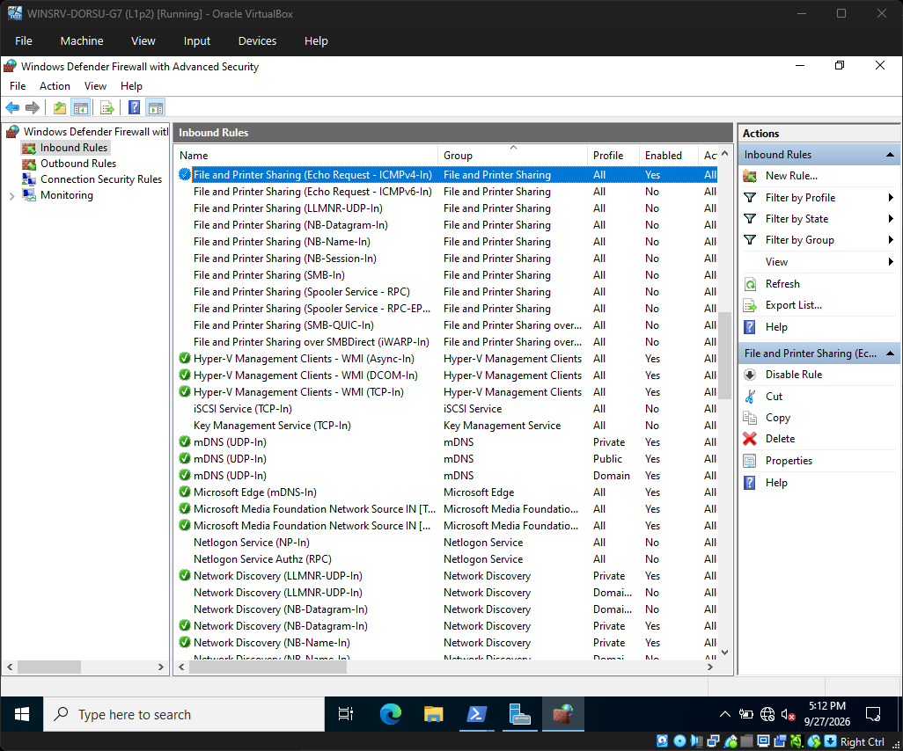

---

# Member 2 — Ubuntu Server Installer

### Screenshot 06 — VirtualBox VM Settings

**Purpose:** Show the configuration of the Ubuntu Server guest.

**Expected settings:**

| Setting   | Required Value                  |
| --------- | ------------------------------- |
| VM Name   | `UBSRV-DORSU-[GroupID]`       |
| Type      | Linux                           |
| Version   | Ubuntu (64-bit)                 |
| RAM       | 2048 MB                         |
| CPU       | 2                               |
| Disk      | 30 GB VDI                       |
| Disk Type | Dynamic                         |
| Adapter 1 | Bridged Adapter                 |
| Interface | Host's wired Ethernet interface |

**Screenshot:**

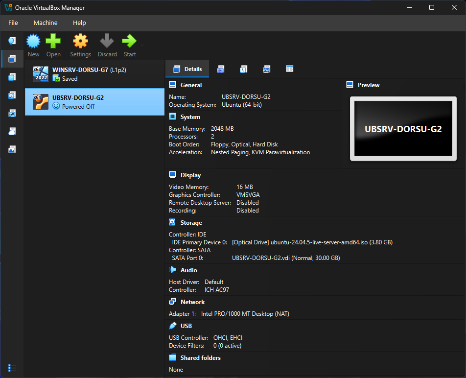

---

### Screenshot 07 — VirtualBox Network Adapter

**Purpose:** Show that Adapter 1 is configured as Bridged.

**Expected:**

```text
Adapter 1
Attached to: Bridged Adapter
Name: [Host's wired Ethernet interface]
```

**Screenshot:**

 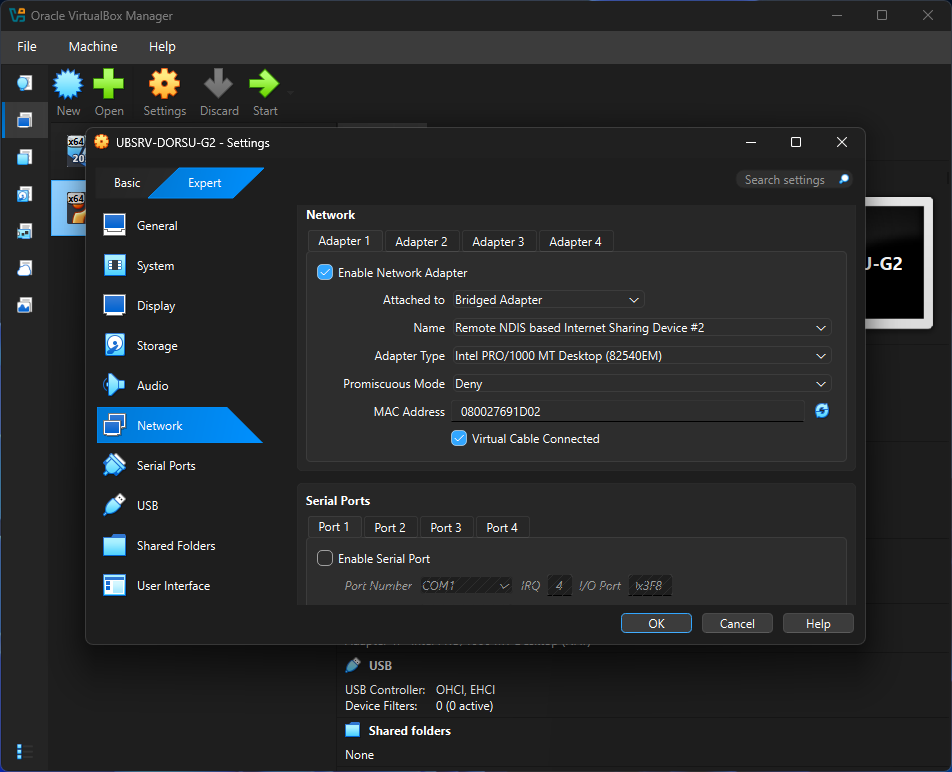

---

### Screenshot 08 — Ubuntu Server Installation Login

**Purpose:** Show that Ubuntu Server 24.04 LTS was successfully installed.

**Expected:**

```text
Ubuntu Server 24.04 LTS
Username: sysadmin
Server name: ubsrv-dorsu-[GroupID]
```

**Screenshot:**

 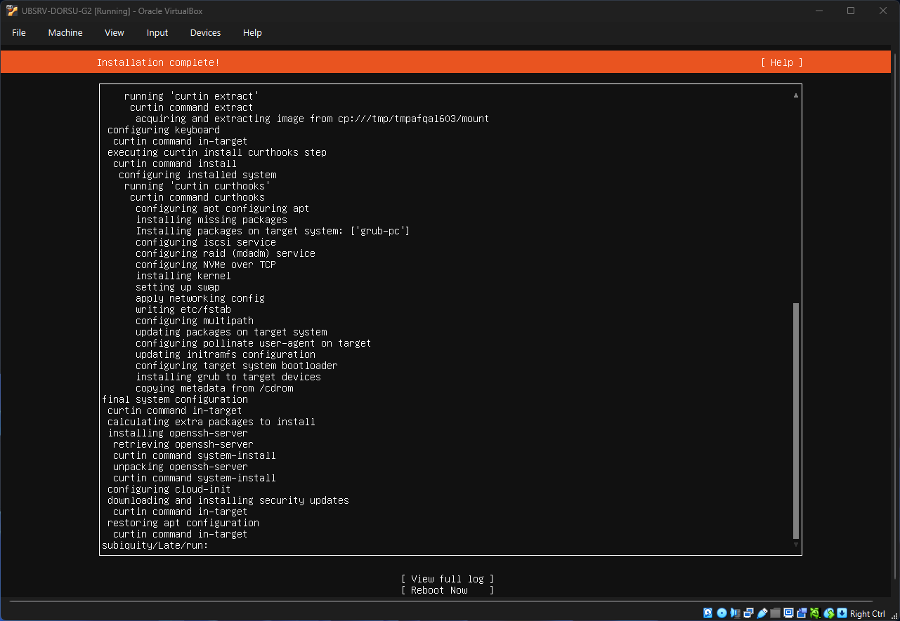 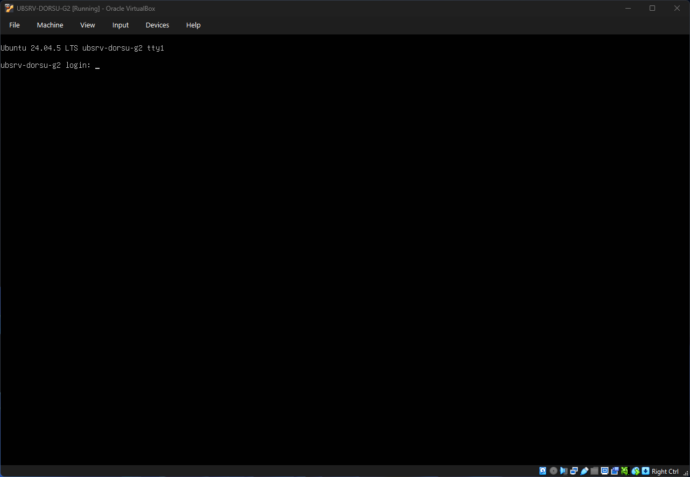 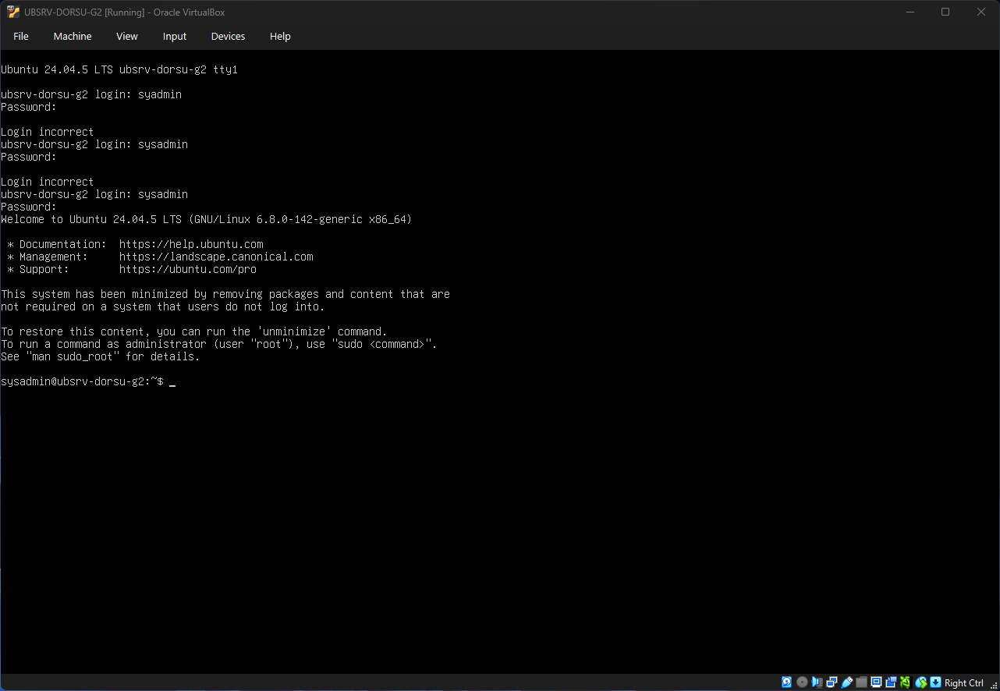

---

### Screenshot 09 — System Update

**Purpose:** Show that the Ubuntu Server packages were updated.

**Command:**

```bash
sudo apt update && sudo apt full-upgrade -y
```

**Screenshot:**

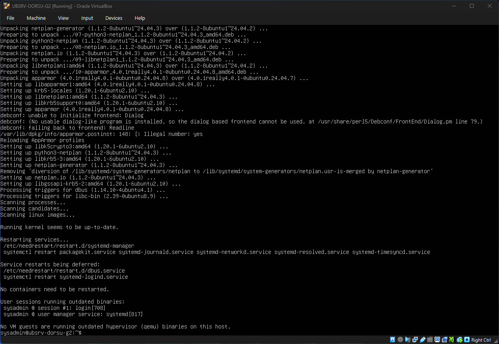

---

### Screenshot 10 — Required Packages Installed

**Purpose:** Show that the required packages were installed.

**Command:**

```bash
sudo apt install net-tools curl htop tree -y
```

**Screenshot:**

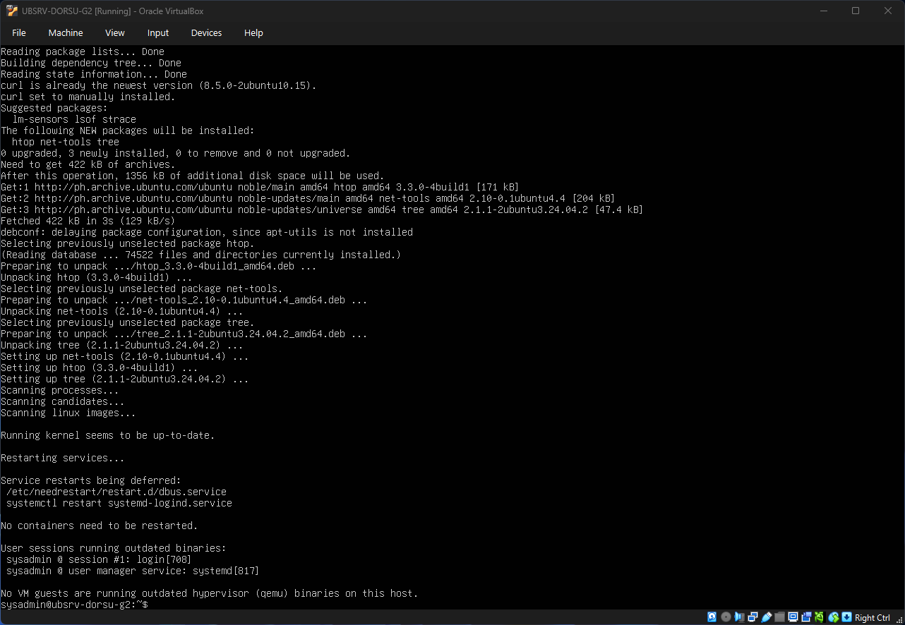

---

### Screenshot 11 — SSH Socket Status

**Purpose:** Verify that OpenSSH is listening through `ssh.socket`.

**Commands:**

```bash
systemctl status ssh.socket
```

and:

```bash
systemctl is-enabled ssh.socket
```

**Expected:**

```text
active (listening)
```

and:

```text
enabled
```

**Screenshot:**

 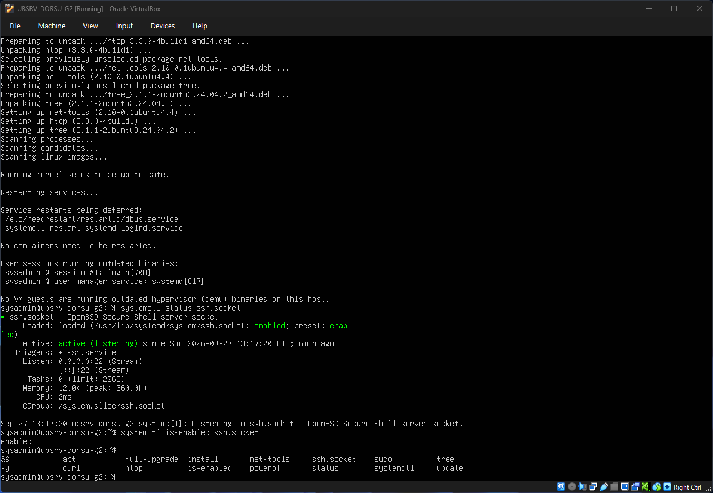

---

### Screenshot 12 — Ubuntu Server VM Hostname and Timezone

**Purpose:** Verify the Ubuntu hostname and timezone.

**Commands:**

```bash
hostnamectl
```

and:

```bash
timedatectl
```

**Expected hostname:**

```text
ubsrv-dorsu-[GroupID]
```

**Expected timezone:**

```text
Asia/Manila
```

**Screenshot:**

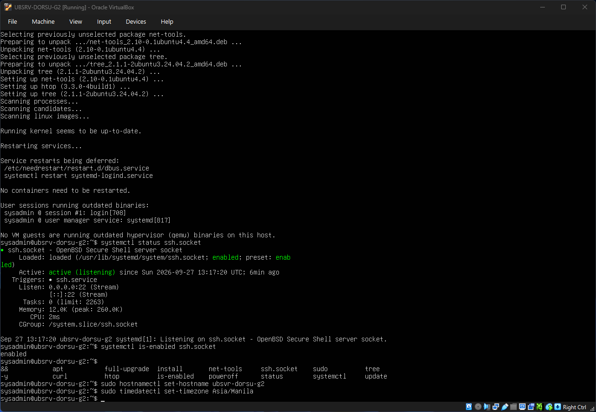

---

# Member 3 — Network Configurator

### Screenshot 13 — Ubuntu Server VM Network Interface

**Purpose:** Identify the actual bridged network interface before editing Netplan.

**Command:**

```bash
ip a
```

**Expected:**

Identify the interface connected to the bridged adapter.

Example:

```text
enp0s3
```

**Important:** Do not assume the interface is `enp0s3`.

**Screenshot:**

> Insert Screenshot 13 here. (WALA NA SCREENSHOT 💀 - NOT REQUIRED SIGURO HUEHUE)

---

### Screenshot 14 — Netplan Configuration File

**Purpose:** Show the static network configuration.

**Expected configuration should contain:**

```yaml
dhcp4: false
addresses:
  - 192.168.10.12/24
routes:
  - to: default
    via: 192.168.10.1
nameservers:
  addresses:
    - [DNS SERVER]
```

**Screenshot:**

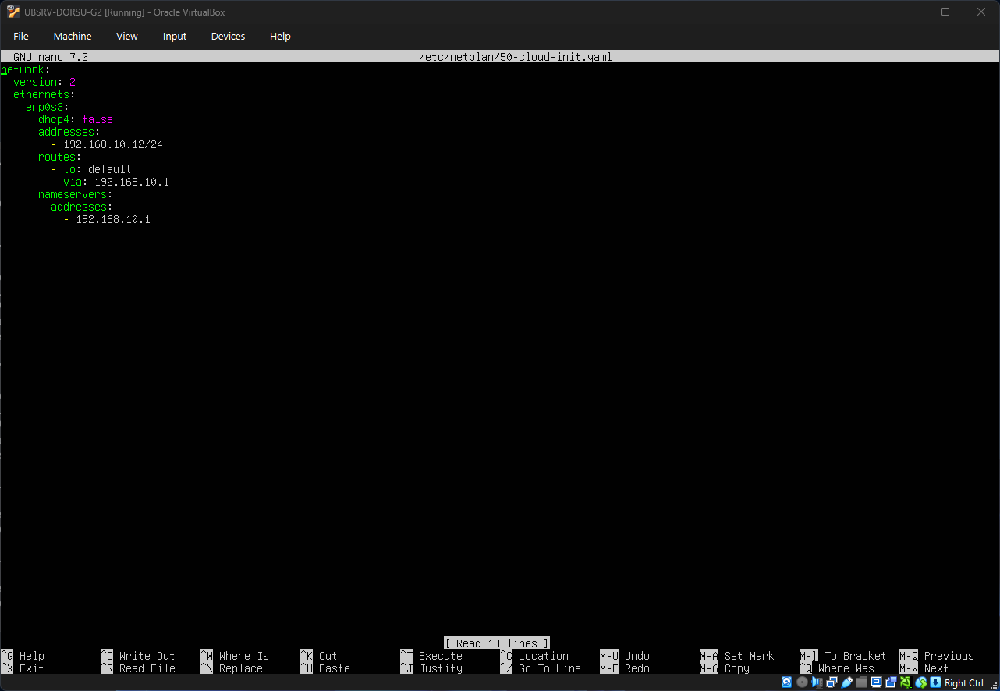

---

### Screenshot 15 — Netplan File Permissions

**Purpose:** Verify that the Netplan configuration file has the required permissions.

**Command:**

```bash
ls -l /etc/netplan/
```

The Netplan configuration file should have permissions equivalent to:

```text
-rw-------
```

which corresponds to:

```bash
chmod 600
```

**Screenshot:**

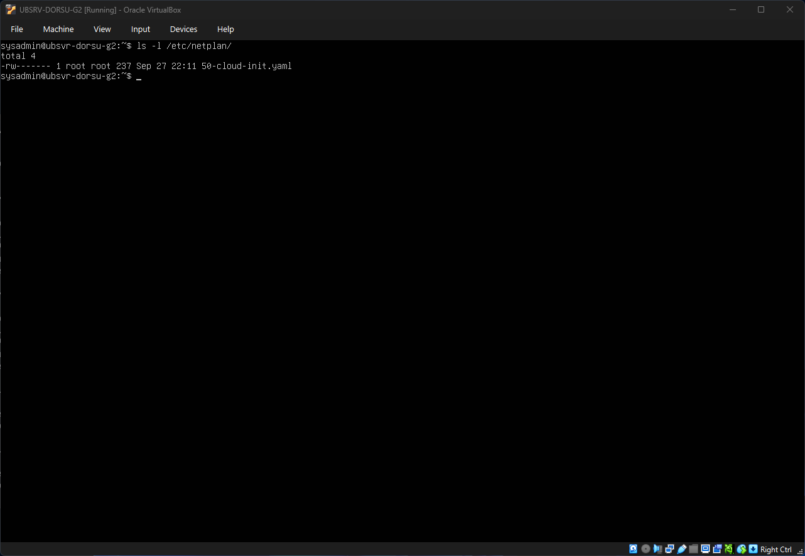

---

### Screenshot 16 — Netplan Applied Successfully

**Purpose:** Show that the Netplan configuration was applied without warnings.

**Command:**

```bash
sudo netplan try
```

**Screenshot:**

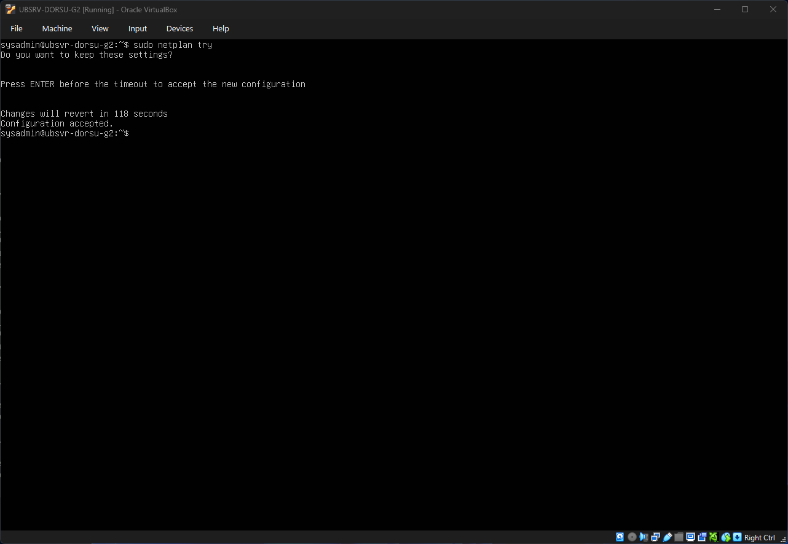

---

### Screenshot 17 — IP Address Verification

**Purpose:** Verify the Ubuntu Server VM static IP.

**Command:**

```bash
ip a
```

**Expected:**

```text
192.168.10.12/24
```

**Screenshot:**

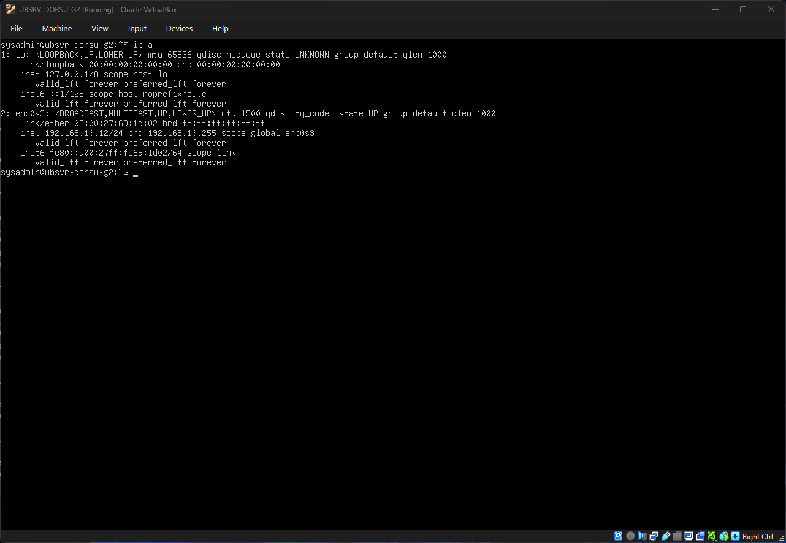

---

### Screenshot 18 — Routing Table

**Purpose:** Verify that Ubuntu Server VM has exactly one default route.

**Command:**

```bash
ip route
```

**Expected:**

```text
default via 192.168.10.1
```

There should be exactly **one** default route.

**Screenshot:**

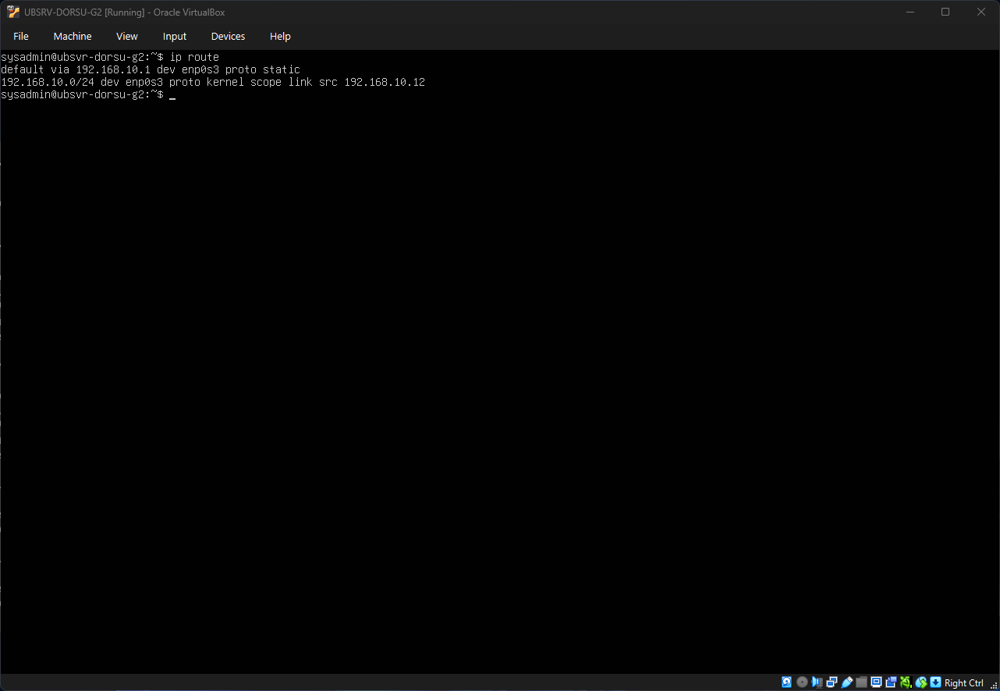

---

### Screenshot 19 — DNS Configuration

**Purpose:** Verify that the DNS server is configured.

**Command:**

```bash
resolvectl status
```

**Expected:**

The configured DNS server should be listed.

**Screenshot:**

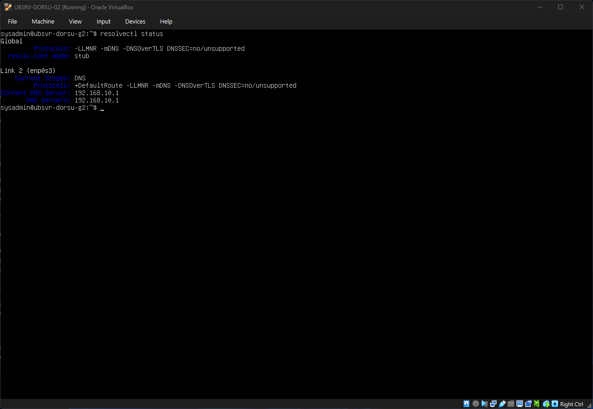

---

### Screenshot 20 — Ubuntu Server VM to Windows Server VM Ping

**Purpose:** Verify connectivity from Ubuntu Server to Windows Server.

**Command:**

```bash
ping 192.168.10.11 -c 4
```

**Expected:**

Four successful replies.

Example:

```text
64 bytes from 192.168.10.11
```

**Screenshot:**

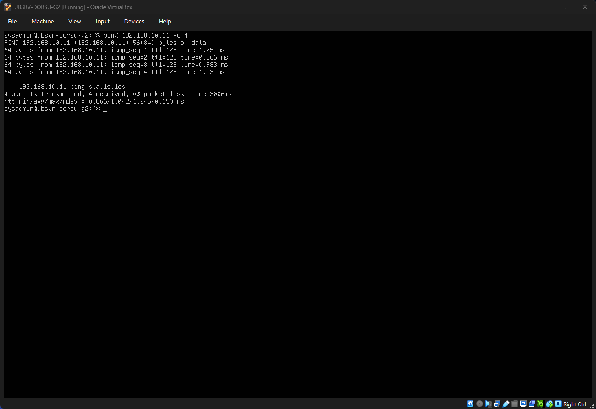

---

### Screenshot 21 — Windows Server VM to Ubuntu Server VM Ping

**Purpose:** Verify connectivity from Windows Server to Ubuntu Server.

**Command:**

```cmd
ping 192.168.10.12 -n 4
```

**Expected:**

Four successful replies.

**Screenshot:**

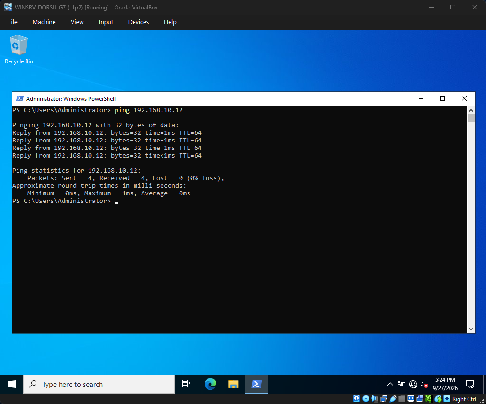

---

### Screenshot 22 — SSH from Host to Ubuntu Server VM

**Purpose:** Verify SSH access to Ubuntu from the host computer.

**Command:**

```bash
ssh sysadmin@192.168.10.12
```

**Expected:**

Successful login to Ubuntu Server and a shell prompt.

**Screenshot:**

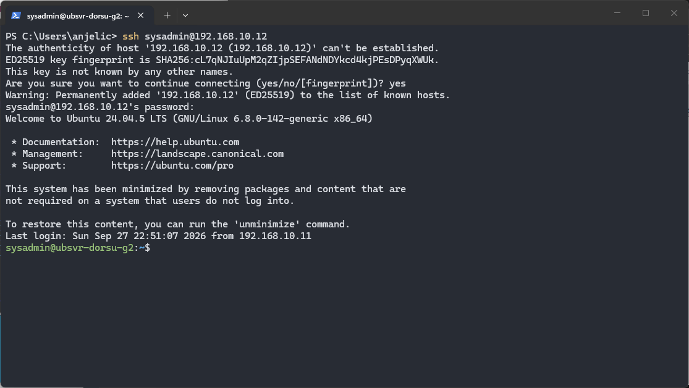

---

### Screenshot 23 — SSH from Windows Server VM to Ubuntu Server VM

**Purpose:** Verify SSH access to Ubuntu from Windows Server.

**Command:**

```cmd
ssh sysadmin@192.168.10.12
```

Accept the fingerprint if prompted.

Then run:

```bash
hostname && uptime
```

**Expected:**

The hostname should show:

```text
ubsrv-dorsu-[GroupID]
```

followed by the system uptime.

**Screenshot:**

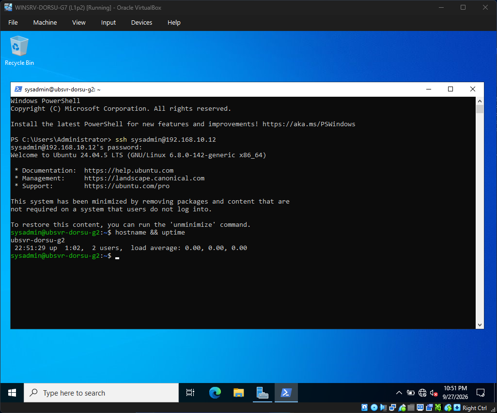

**Status:** ☐ PASS ☐ NEEDS FIX

# Final Screenshot Checklist

## Member 1

- [ ] Screenshot 01 — Hostname
- [ ] Screenshot 02 — `ipconfig /all`
- [ ] Screenshot 03 — Remote Desktop
- [ ] Screenshot 04 — RSAT
- [ ] Screenshot 05 — ICMPv4 Firewall Rule

## Member 2

* [ ] Screenshot 06 — VirtualBox VM settings
* [ ] Screenshot 07 — Bridged network adapter
* [ ] Screenshot 08 — Ubuntu installation/login
* [ ] Screenshot 09 — `apt update` and `full-upgrade`
* [ ] Screenshot 10 — Required packages
* [ ] Screenshot 11 — `ssh.socket`
* [ ] Screenshot 12 — Hostname and timezone

## Member 3

* [ ] Screenshot 13 — `ip a`
* [ ] Screenshot 14 — Netplan configuration
* [ ] Screenshot 15 — Netplan permissions
* [ ] Screenshot 16 — `netplan try`
* [ ] Screenshot 17 — Ubuntu IP
* [ ] Screenshot 18 — `ip route`
* [ ] Screenshot 19 — `resolvectl status`
* [ ] Screenshot 20 — Ubuntu → Windows ping
* [ ] Screenshot 21 — Windows → Ubuntu ping
* [ ] Screenshot 22 — Host → Ubuntu SSH
* [ ] Screenshot 23 — Windows → Ubuntu SSH

## Member 4

* [ ] Screenshot 24 — Installation Verification Checklist
* [ ] Screenshot 25 — OS Comparison Table
* [ ] Screenshot 26 — Network Diagram
* [ ] Screenshot 27 — Final Group Documentation
